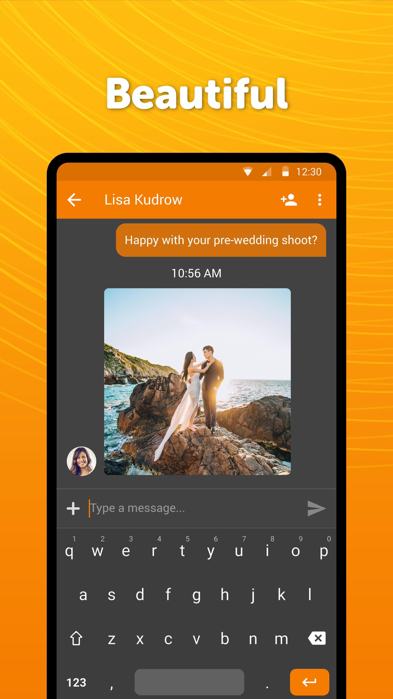
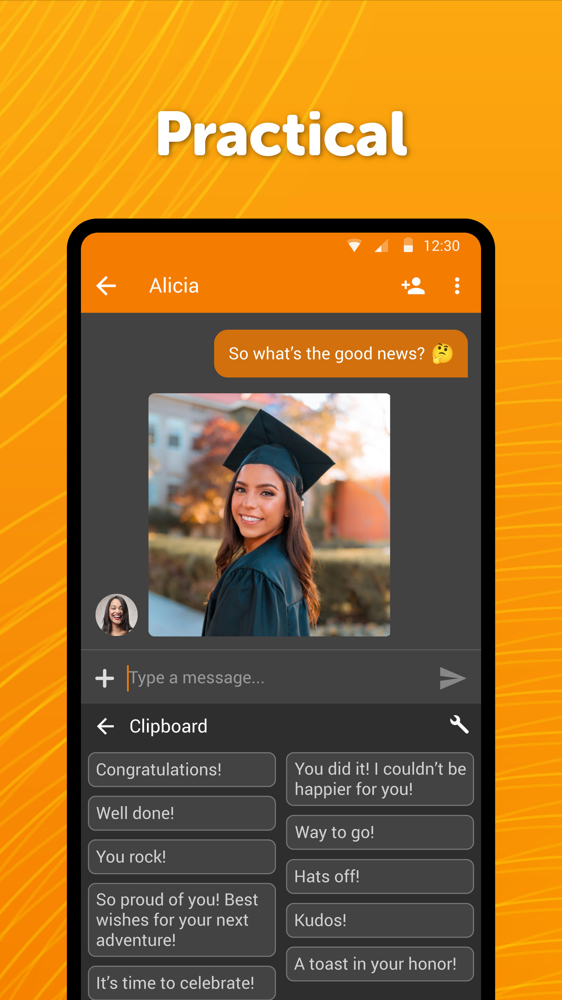

# Simple Keyboard

A quick lightweight keyboard app that helps chatting with your friends, or inserting any other texts, numbers or symbols.

It comes with material design and dark theme by default, provides great user experience for easy usage. The lack of internet access gives you more privacy, security and stability than other apps.

Contains no ads or unnecessary permissions. It is fully opensource, provides customizable colors.

<b>Check out the full suite of Simple Tools here:</b>
https://www.simplemobiletools.com

<b>Facebook:</b>
https://www.facebook.com/simplemobiletools

<b>Reddit:</b>
https://www.reddit.com/r/SimpleMobileTools

